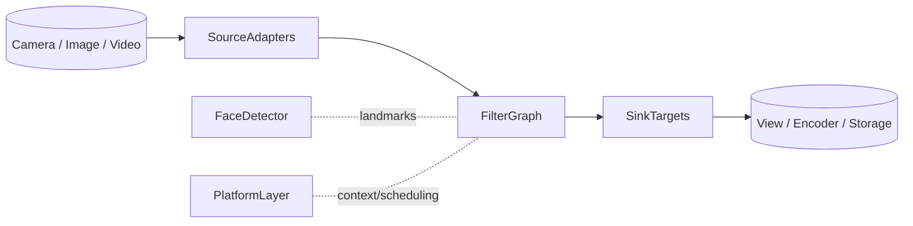

## 1. Purpose & Scope

- Clarify how GPUPixel transforms raw camera or image buffers into beautified frames across iOS, Android, desktop, and WebAssembly-ready targets.
- Document the responsibilities and contracts of each module so Kotlin/Swift/UI layers can integrate safely.
- Provide guidance for extending filters, sources, and sinks while staying compliant with the project’s threading, memory, and performance expectations.

## 2. System Overview

GPUPixel is a C++11/OpenGL-ES pipeline organized around **Source → Filter Graph → Sink** primitives (`include/gpupixel`). The runtime keeps a tiny footprint, relies on shader-based processing, and exposes bindings for Android (JNI + Kotlin), iOS/macOS (Objective-C++/Swift), and desktop demos.

Key design levers:
- **OpenGL/ES context orchestration** is centralized in `GPUPixelContext`, which hides platform differences and offers a single entry point to GL resources.
- **Framebuffers are pooled** via `FramebufferFactory` to reduce GPU churn, while filters request reusable textures.
- **Dispatch queues** serialize GPU work and provide predictable threading for UI integrations that rely on Kotlin coroutines or Swift concurrency.
- **Beauty filters** compose shader programs plus optional CPU-driven pre-processing such as Mars-Face landmarks.

## 3. Layered Architecture

### 3.1 Platform & Build Layer

- **Platform detection** (`gpupixel_define.h`) sets `GPUPIXEL_*` macros, chooses GL vs. GLES shaders, and exposes visibility attributes for shared objects.
- **Build system** uses CMake + CPM to orchestrate third-party dependencies, with helper scripts under `script/` for Android/iOS/Linux/macOS/Windows.
- **Docs & examples** live under `docs/` and `demo/`, demonstrating how host apps (e.g., Android Kotlin View + MVVM) should wire the native core.

### 3.2 Core GPU Runtime

- `GPUPixelContext` constructs and owns GL contexts (EAGL, EGL, NSOpenGL, GLFW, or Emscripten), exposes `SyncRunWithContext`, and presents framebuffers to the display.
- `GPUPixelFramebuffer` wraps texture/FBO pairs, while `FramebufferFactory` caches them per size/format combination.
- `DispatchQueue` executes GPU-bound tasks off the UI thread; it publishes `runTask`, `stop`, and `isWorkerThread` for synchronization.

### 3.3 Data-Plane Components

- **Source** (`Source`, `SourceImage`, `SourceRawData`) owns the upstream framebuffer, scales/rotates content, and fans out to downstream sinks.
- **Filter graph** (`Filter`, `FilterGroup`, ~40+ concrete filters) inherits from both `Source` and `Sink`, so each filter can be chained.
- **Sink** implementations (`SinkRender`, `SinkRawData`, `SinkSurface`, `SinkView`) consume framebuffers for on-screen compositing, CPU readback, or encoding.

### 3.4 Feature Modules

- **Face detector** wraps Mars-Face to deliver 106-point landmarks that drive geometry-aware filters.
- **Beauty face stack** combines multiple shader passes (smoothing, whitening, reshaping, cosmetics) orchestrated by `BeautyFaceFilter`.
- **Utility math** (e.g., warping matrices in `math_toolbox`) feeds shader uniforms and deformation transforms.

## 4. Data & Control Flow

1. **Frame ingestion** – Cameras or file decoders feed `SourceRawData` or `SourceImage`, optionally passing through libyuv conversions (Android JNI).
2. **Graph construction** – Host code instantiates `Filter` objects via the built-in factory (`Filter::Create`) and chains them with `AddSink`.
3. **Scheduling** – Sources call `DoRender`, which pushes work onto the dispatch queue and binds the GL context before executing shader programs.
4. **Filter execution** – Each filter binds its `GPUPixelGLProgram`, configures uniforms/properties, and renders into a framebuffer.
5. **Output** – Sinks either draw to a platform surface (`SinkSurface`/`SinkView`) or expose raw buffers for encoders and network stacks.

## 5. Component Reference

### 5.1 Source Adapters

- `SourceImage::Create / CreateFromBuffer` load RGBA assets or memory buffers, while `SourceRawData` handles streaming frames (e.g., camera preview).
- Sources track downstream consumers through `AddSink` and maintain rotation/scale metadata so filters can align textures correctly.
- Resources are released via `ReleaseFramebuffer`, letting the factory recycle GPU memory without stalls.

### 5.2 Filter Graph

- `Filter` encapsulates shader compilation, vertex/fragment shader sources, property registration, and lifecycle.
- Property APIs (`RegisterProperty`, `SetProperty`, `GetProperty`) allow UI layers (Kotlin/Swift MVVM view models) to adjust strength, colors, or LUTs dynamically.
- `FilterGroup` nests filters to build reusable presets (e.g., skin pipeline + cosmetics).

### 5.3 Sink Targets

- `SinkRender` draws to the active GL context for preview surfaces.
- `SinkSurface` / `SinkView` wrap platform views (GLSurfaceView, CAMetalLayer-equivalent) so UI code only needs to attach/detach surfaces.
- `SinkRawData` copies pixels back to CPU memory when exporting frames or running CPU-based analytics.

### 5.4 Face Detector & Geometry Utilities

- `FaceDetector::Detect` accepts raw data, transforms it according to `GPUPIXEL_MODE_FMT` and `GPUPIXEL_FRAME_TYPE`, then emits normalized landmarks that beauty filters consume.
- Geometry helpers in `math_toolbox` compute matrices used by reshaping filters (face slimming, big-eye, etc.).

## 6. Resource & Performance Management

- **Framebuffer pooling** keeps GPU memory fragmentation low; filters request textures through the factory instead of glGen/glDelete churn.
- **Lazy shader compilation** – `Filter::InitWithShaderString` compiles only when the filter is first used, keeping load-time short.
- **Threading model** – All GL work runs on the context thread. The dispatch queue shields the Kotlin/Swift UI threads; use coroutines/Dispatchers.Main for UI, Dispatchers.Default for heavy CPU pre-processing.
- **Libyuv acceleration** – Android JNI bridges convert YUV420/NV21 into RGBA before uploading textures, leveraging SIMD intrinsics.

## 7. Platform Integration & Host Guidelines

### 7.1 Android (Kotlin + MVVM + Coroutines + Koin)

- **JNI bridge** (`src/android/jni/*.cc`) exposes helpers for YUV↔RGBA conversion, face detection entry points, and lifecycle hooks, while `src/android/java/com/pixpark/gpupixel/*.java` provides the Java façade consumed by Kotlin.
- **Recommended stack**:  
  - Use a `View` or `SurfaceView` that hosts a `SinkSurface`.  
  - Wrap native calls inside a Kotlin repository injected by **Koin** so ViewModels stay testable.  
  - Drive frame ingestion with Kotlin **coroutines** (e.g., `Flow` of camera frames) and expose filter states through MVVM `StateFlow`.  
  - Convert coroutines to native callbacks via `Dispatchers.Default` → JNI to avoid blocking the UI thread.

### 7.2 iOS & macOS (SwiftUI/UIKit)

- Objective-C++ bridges under `src/sink/objc_view.mm` and `include/gpupixel/sink/sink_view.h` expose a view that can be wrapped by SwiftUI/UIViewRepresentable.
- Use `GPUPixelContext::SyncRunWithContext` to marshal work back onto the GL thread before touching UIKit/Metal surfaces.

### 7.3 Windows/Linux/Desktop

- GLFW contexts (see `GPUPIXEL_WIN`/`LINUX` branches) allow integration with Qt or ImGui preview windows.
- `demo/desktop/app.cc` demonstrates creating sources, chaining filters, and blitting to a window for quick regressions.

### 7.4 WebAssembly (Preview)

- `GPUPIXEL_WASM` guards ensure shaders use GLES semantics; Emscripten builds can host the pipeline inside WebGL2 contexts once the toolchain is enabled.

## 8. Build, Packaging & Deployment

- Entry `CMakeLists.txt` aggregates core targets plus platform toggles (Android NDK, iOS toolchain files, CPM third-party libs).
- Helper scripts (`script/build_android.sh`, etc.) wrap toolchain setup, dependency sync, and artifact packaging.
- Demo apps (`demo/android`, `demo/ios`, `demo/desktop`) double as integration tests and showcase best practices for dependency injection, MVVM, and UI composition.

## 9. Extensibility Guidelines

- **Custom filters** – Derive from `Filter`, register uniforms/properties, and add them to the factory via static registration macros so UI layers can instantiate them by name.
- **Custom sources** – Implement the `Source` interface if ingesting from network streams or camera HALs; ensure you honor `framebuffer_scale_` and rotation metadata.
- **Custom sinks** – Useful for video encoders or cloud streaming endpoints; implement `Render` to consume framebuffers without stalling the main graph.
- **Configuration surfaces** – Persist filter presets as JSON/YAML in host apps and replay them via property APIs.

## 10. Testing & Observability

- Use the desktop demo with scripted frames to validate filter output deterministically before shipping mobile builds.
- Instrument JNI bridges with `LOG_*` macros (`utils/logging.h`) and forward logs to Android Logcat / iOS os_log.
- Add GPU timing queries around expensive filters (e.g., convolution kernels) to catch shader regressions early.

## 11. Reference Tables

| Category | Location | Notes |
| --- | --- | --- |
| Core headers | `include/gpupixel` | Public API consumed by host languages |
| Filters | `include/gpupixel/filter` & `src/filter` | Each `.h/.cc` pair implements one shader |
| Sources/Sinks | `include/gpupixel/source` / `include/gpupixel/sink` | Entry/exit points for pipelines |
| Face detection | `face_detector/` | Mars-Face integration + models |
| Utilities | `src/utils` | Dispatch queue, math helpers, logging |
| Platform bridges | `src/android`, `demo/ios`, `demo/desktop` | Reference integrations |

---

**Next steps:**  
- Mirror this document in Chinese (`docs/docs/zh/wiki/architecture.md`).  
- Link both pages from the main README/wiki index once reviewed.
