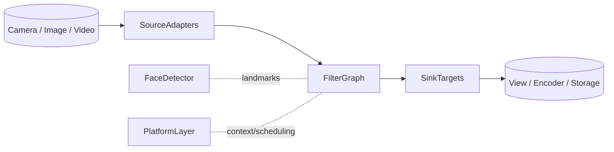

## 1. 文档目的

- 说明 GPUPixel 如何把相机/图片/视频数据在 iOS、Android、桌面与 WebAssembly 场景下转换成美颜画面。
- 梳理各模块职责，便于 Kotlin/Swift/UI 层安全集成。
- 提供扩展滤镜、Source、Sink 时必须遵循的线程、内存与性能准则。

## 2. 系统总览

GPUPixel 基于 C++11 与 OpenGL/ES，围绕 **Source → Filter Graph → Sink** 三段式抽象构建（参见 `include/gpupixel`）。核心库保持极小体积，依赖 GPU shader 完成计算，并通过 Android（JNI+Kotlin）、iOS/macOS（Objective-C++/Swift）与桌面演示工程对外暴露。

设计关键点：
- `GPUPixelContext` 统一管理不同平台的 GL/GLES 上下文，对上层屏蔽差异。
- `FramebufferFactory` 负责 Framebuffer/Texture 复用，降低 GPU 频繁创建/销毁的成本。
- `DispatchQueue` 串行化 GPU 任务，保证 Kotlin 协程或 Swift 并发模型与底层线程安全衔接。
- 美颜滤镜支持多 Pass 组合，并可叠加 Mars-Face 人脸关键点等 CPU 预处理步骤。

## 3. 分层架构

### 3.1 平台与构建层

- `gpupixel_define.h` 内的 `GPUPIXEL_*` 宏决定平台特性、GL/GLES shader 选择以及动态库可见性。
- 顶层 `CMakeLists.txt` 配合 CPM 管理依赖，`script/` 目录提供 Android/iOS/Linux/macOS/Windows 构建脚本。
- `docs/` 与 `demo/` 目录中的示例给出了 Android Kotlin View + MVVM 等典型接入方式。

### 3.2 GPU 运行时

- `GPUPixelContext` 负责创建/销毁并持有 EAGL、EGL、NSOpenGL、GLFW 或 Emscripten 上下文，并提供 `SyncRunWithContext`、`PresentBufferForDisplay` 等 API。
- `GPUPixelFramebuffer` 封装纹理+FBO，`FramebufferFactory` 依据宽高/格式缓存实例。
- `DispatchQueue` 在后台线程执行 GPU 任务，向上暴露 `runTask`、`stop`、`isWorkerThread` 等同步手段。

### 3.3 数据面组件

- **Source**（`Source`、`SourceImage`、`SourceRawData`）维护上游 Framebuffer，并根据旋转/缩放信息把数据分发给多个 Sink。
- **Filter Graph**（`Filter`、`FilterGroup` 及 40+ 具体滤镜）同时继承 Source 与 Sink，可任意串联。
- **Sink**（`SinkRender`、`SinkRawData`、`SinkSurface`、`SinkView`）负责把数据送往显示、CPU 读回或编码器。

### 3.4 特性模块

- **FaceDetector** 基于 Mars-Face 输出 106 点关键点，供瘦脸/大眼等几何滤镜使用。
- **BeautyFaceFilter** 在一次渲染链路内组织磨皮、美白、重塑、彩妆等多 Pass。
- **math_toolbox** 等工具提供矩阵/坐标变换能力。

## 4. 数据与控制流程

1. **采集**：相机或文件解码器把 RGBA/YUV 帧送入 `SourceRawData`/`SourceImage`；Android 侧可先通过 libyuv JNI 转换。
2. **构图**：宿主代码通过 `Filter::Create` 实例化滤镜，并通过 `AddSink` 串联成图。
3. **调度**：Source 调用 `DoRender`，向 DispatchQueue 投递任务并绑定 GL 上下文。
4. **滤镜执行**：每个滤镜绑定 `GPUPixelGLProgram`，设置 uniform/属性后渲染至 framebuffer。
5. **输出**：Sink 将结果绘制到平台 Surface、视图或导出为 CPU Buffer/编码数据。

## 5. 组件速查

### 5.1 Source

- `SourceImage::Create / CreateFromBuffer` 支持从资源或内存初始化，`SourceRawData` 适合相机流/SDK 供帧。
- `AddSink`/`RemoveSink` 管理下游依赖，`ReleaseFramebuffer` 允许工厂回收 GPU 资源。

### 5.2 Filter Graph

- `Filter` 负责 shader 编译、属性注册及生命周期。
- `RegisterProperty` / `SetProperty` / `GetProperty` 方便 Kotlin/Swift MVVM ViewModel 按需调节强度、颜色或 LUT。
- `FilterGroup` 组合多个滤镜构建可复用的“效果包”。

### 5.3 Sink

- `SinkRender` 在当前 GL 上下文绘制预览。
- `SinkSurface` / `SinkView` 封装 GLSurfaceView、CAMetalLayer 等平台视图，减少 UI 层绑定成本。
- `SinkRawData` 用于导出图像或喂给 CPU 后处理/编码器。

### 5.4 FaceDetector 与几何工具

- `FaceDetector::Detect` 根据 `GPUPIXEL_MODE_FMT` 与 `GPUPIXEL_FRAME_TYPE` 调整输入并输出归一化关键点。
- `math_toolbox` 提供瘦脸/大眼等滤镜所需的矩阵和几何计算。

## 6. 资源与性能

- **Framebuffer 复用** 降低 GPU 内存碎片；滤镜通过工厂申请纹理，避免频繁 glGen/glDelete。
- **延迟编译**：`Filter::InitWithShaderString` 在首次使用时才编译 shader，缩短加载时间。
- **线程模型**：全部 GL 调用都在上下文线程完成。Android 建议 UI 使用协程 `Dispatchers.Main`，耗时/Native 调度走 `Dispatchers.Default` 后再 JNI 进入 DispatchQueue。
- **libyuv 加速**：JNI 层负责 YUV420/NV21 ↔ RGBA 转换，充分利用 SIMD。

## 7. 平台集成指引

### 7.1 Android（View + Kotlin + Coroutines + Koin + MVVM）

- `src/android/jni/*.cc` 提供 YUV↔RGBA 转换、人脸检测和生命周期桥接；`src/android/java/com/pixpark/gpupixel/*.java` 则向 Kotlin 层暴露接口。
- 推荐架构：  
  - 以 `GLSurfaceView`/`TextureView` 等 `View` 承载 `SinkSurface`。  
  - 使用 Koin 注入封装原生调用的 Repository，在 MVVM ViewModel 中通过协程流 (`Flow`/`StateFlow`) 管理滤镜状态。  
  - 将协程任务切到 `Dispatchers.Default` 再 JNI 回调，避免阻塞 UI 线程。  
  - 通过 DataBinding/Compose 将滤镜属性与 `RegisterProperty` 暴露的参数实时绑定。

### 7.2 iOS / macOS

- `src/sink/objc_view.mm` 与 `include/gpupixel/sink/sink_view.h` 提供可直接嵌入 SwiftUI/UIViewController 的视图封装。
- 通过 `GPUPixelContext::SyncRunWithContext` 保证所有 GL 调用回到上下文线程后再与 UIKit/AppKit 交互。

### 7.3 Windows / Linux / 桌面

- `GPUPIXEL_WIN`/`GPUPIXEL_LINUX` 分支底层依赖 GLFW，可轻松嵌入 Qt、ImGui 等 UI。
- `demo/desktop/app.cc` 展示了 Source/Filter/Sink 的最小串联方案，可作为集成测试脚本。

### 7.4 WebAssembly（规划中）

- `GPUPIXEL_WASM` 宏会选择 GLES 版 shader，后续可通过 Emscripten 构建运行在 WebGL2 上。

## 8. 构建与发布

- CMake 入口聚合核心目标与平台开关，iOS 使用 `ios.toolchain.cmake`，Android 依赖 NDK 配置。
- `script/build_*.sh` 封装依赖下载、工具链配置与产物打包。
- `demo/android`、`demo/ios`、`demo/desktop` 既是示例也是端到端验证手段，可结合 CI 回归。

## 9. 扩展准则

- **自定义滤镜**：继承 `Filter`，注册属性/Uniform，并通过工厂注册以便名称实例化。
- **自定义 Source**：适配网络流/相机 HAL 时需正确处理 `framebuffer_scale_` 与旋转信息。
- **自定义 Sink**：适合写入编码器、云端推流或第三方渲染器，实现 `Render` 即可消费 framebuffer。
- **配置管理**：宿主可将滤镜预设保存为 JSON/YAML，启动后按照属性 API 回放。

## 10. 测试与可观测性

- 桌面 demo 支持脚本化输入，便于在发布前对滤镜结果做确定性比对。
- JNI 层日志可通过 `utils/logging.h` 的 `LOG_*` 宏输出到 Android Logcat / iOS os_log。
- 对卷积等重滤镜可加 GPU 时间查询，及时发现 shader 性能回退。

## 11. 参考索引

| 分类 | 路径 | 说明 |
| --- | --- | --- |
| 核心头文件 | `include/gpupixel` | 提供给宿主语言的公开 API |
| 滤镜实现 | `include/gpupixel/filter` & `src/filter` | 每个 `.h/.cc` 对应一个 shader |
| Source / Sink | `include/gpupixel/source` / `include/gpupixel/sink` | 管理数据入口与出口 |
| 人脸检测 | `face_detector/` | 集成 Mars-Face 的检测能力 |
| 工具模块 | `src/utils` | DispatchQueue、数学工具、日志 |
| 平台桥接 | `src/android`、`demo/ios`、`demo/desktop` | 官方集成示例 |

---

**后续动作：**  
- 将中文页面与英文版互相链接，方便 wiki 导航。  
- 结合产品需求补充更多 MVVM/Kotlin 示例代码。
